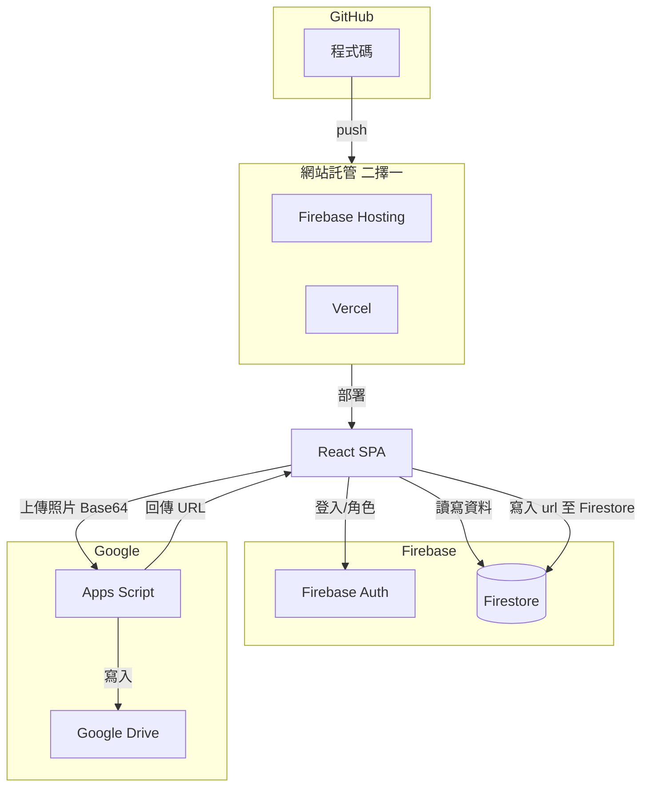

# 906 班網全端優化計畫（依實際程式碼更新）

## 一、現況與目標（依您提供之程式碼）

**現有架構（單一 HTML 親師平台）：**

- **前端：** 單一 `000 (2).txt` 檔案，含 HTML + Tailwind CSS + ES Modules 的內嵌 JavaScript
- **資料來源：** 13 個 Google 試算表（透過 `gviz/tq?tqx=out:csv` 即時取得）
- **上傳：** Google Apps Script Web App，接收 Base64 圖片寫入 Google Drive
- **權限：** 通行碼 `906admin` 保護「常規紀錄」「座位表」「班費」三大區塊
- **Firebase：** 匿名登入（可選）


| 現況                    | 目標                                              |
| --------------------- | ----------------------------------------------- |
| 單一 HTML + 13 個分散試算表   | React SPA + Firestore                           |
| CSV 即時拉取、無後端          | Firebase SDK 直接讀寫                               |
| 通行碼保護三區塊              | Firebase Auth + 角色權限（teacher / staff / student） |
| Apps Script 上傳至 Drive | 沿用 Google Drive（容量較大，15GB+ 免費）                  |
| 無版本控制、手動發布            | GitHub + Firebase Hosting / Vercel 部署           |


## 二、建議技術架構（GitHub + Firebase + Google Drive）

依需求：**Firebase Auth、Firestore** + **相簿存 Google Drive**（避免 Firebase Storage 5GB 限制）+ **Firebase Hosting 或 Vercel 發布**：




**技術選型：**

- **前端：** React 18 + Vite、React Router、Tailwind CSS
- **認證：** Firebase Auth（Email/密碼 或 Google 登入）
- **資料庫：** Firestore（公告、作業、課表、常規、班費等 structured data）
- **相簿：** Google Drive（經 Apps Script），Firestore 只存 `url, title, album, desc, date, uploader` 等 metadata
- **部署：** Firebase Hosting（與 Firebase 同一專案）或 Vercel（二擇一）

**容量說明：**

- **Firebase Hosting**（放網站程式）：10GB、360MB/日流量，放 React build 足夠
- **Firestore**：存文字/結構資料，班網用量小
- **Google Drive**：相簿照片，免費 15GB+，較適合大量圖片

## 三、現有模組與試算表對應（依程式碼整理）

以下為您程式碼中實際使用的模組與試算表結構：


| 模組      | 試算表 gid / 用途                | 欄位結構（依程式碼推斷）                                 |
| ------- | --------------------------- | -------------------------------------------- |
| **公告**  | BULLETIN                    | imp, cat, date, title, due, content（含圖片 URL） |
| **作業**  | HOMEWORK                    | 項目, 狀態, 缺交人數, 未交座號                           |
| **課表**  | SCHEDULE / TEACHER_SCHEDULE | 節次 × 週一～五，班級/教師課表                            |
| **日程**  | 整合 BULLETIN + COUNTDOWN     | -                                            |
| **倒數**  | COUNTDOWN                   | rating(星等), title, date, end, subj1, subj2   |
| **榮譽榜** | HONOR_ROLL                  | 進步獎 title, w1~~w4, 前三名 title, w1~~w3         |
| **常規**  | VIOLATIONS                  | 日期, 座號, ?, ?, 事由, 課堂, 節次, 扣分, ?, 狀態          |
| **座位**  | SEATING                     | B1:I50 網格（座號/姓名）                             |
| **相簿**  | GALLERY                     | url, title, album, desc, date, uploader      |
| **塗鴉**  | 無 DB，畫布可上傳至相簿               | -                                            |
| **班費**  | CLASS_FUND                  | 日期, 項目, 收入, 支出, 備註（YOUR_SHEET_ID 待替換）        |
| **文章**  | STORIES                     | cat, title, content, oneLiner（支援 YouTube 連結） |
| **占卜**  | 前端寫死 40+ 籤詩                 | -                                            |
| **投票**  | POLLS                       | 截止日, 標題, Form URL, Q1~Q4 標籤與 entry ID        |
| **連結**  | EXTERNAL                    | cat, title, url                              |


**上傳 API：** `Config.UPLOAD_API` 為 Google Apps Script，接收 `{ date, album, title, uploader, desc, filename, image }` 並寫入 Drive。

## 四、資料模型設計（遷移後）


| 功能  | 資料表                | 對應現有欄位                                             |
| --- | ------------------ | -------------------------------------------------- |
| 公告  | `announcements`    | imp, cat, date, title, due, content                |
| 作業  | `homework`         | item, status, missing_count, missing_seats         |
| 課表  | `schedules`        | 班級/教師、節次、科目                                        |
| 倒數  | `countdown_events` | rating, title, date, end, subj1, subj2             |
| 榮譽榜 | `honor_roll`       | 進步獎/前三名 JSON 結構                                    |
| 常規  | `violations`       | date, seat, reason, subject, period, score, status |
| 座位  | `seating`          | 網格 JSON 或每格一列                                      |
| 相簿  | `gallery_photos`   | url（Drive 連結）, title, album, desc, date, uploader  |
| 班費  | `class_fund`       | date, item, income, expense, note                  |
| 文章  | `stories`          | cat, title, content, oneLiner, videoId             |
| 投票  | `polls`            | 或保留 Google Forms 連結                                |
| 連結  | `links`            | cat, title, url                                    |
| 使用者 | `users`            | email, password_hash, role                         |


**權限：** teacher 全開；staff 可編輯公告/作業/相簿/連結；student 唯讀 + 投票/留言。

**試算表 ID 對照（供遷移腳本使用）：**

- HOMEWORK: `1EIsNhRF2FzbZA1YNWI_0KMSo1MRJWjypy_soeABdEeU` (gid=1576528886)
- VIOLATIONS: `1Il-ImSL6y4-H3lG8h8EcwrmJCgl9ywmryqXwPoY5-3E`
- BULLETIN: `1qzPmxx8rAF4J8XKzYDm5nHyjSgFgyKjmEGFb-L-hOgI`
- SEATING: `1ME-7985DEef46m_skJJqLfOnR_emHr9n6ySRCCz1zHk` (gid=1163058622)
- STORIES: `1yNnxYtq_tlrTM24wYC8bvxHc08Y1t8zd9vFub5kUSV8`
- EXTERNAL: `1dNqibbKUvdW7Xp0S5k1q8vuS71b8G4m9_jWmwJVXC3Y`
- POLLS: `1SvK5CTdcW3U_tQ0m_j1WijmUmAxe7LOzGdoYe4PpJls`
- HONOR_ROLL: `1duSPQtXu3boLwPpnrQ_05ToMYLoZWgBnn1idFv4aKlE`
- SCHEDULE: `1ns4zJ8YSSr0p_xJT8Z9eG6fA0Tic42jEAajt48cBQb4` (gid=0 班級, gid=1988816131 教師)
- GALLERY: `11b03-UlYzI5_9vDTOkzFK2y3v3VwlykFyhIq_RkBrlA`
- COUNTDOWN: `1zGH7zE_0Eu2e4rzOozEUSmCR6obYjTON1Y3Qbrfsk0c`

## 五、GitHub + Firebase 部署流程

### 步驟一：建立 GitHub 儲存庫

1. 在 [GitHub](https://github.com/new) 建立新 repo（例：`906-class-website`）
2. 本地初始化並推送：
  ```bash
   cd f:\School\906-class-website
   git init
   git add .
   git commit -m "feat: 初始專案結構"
   git branch -M main
   git remote add origin https://github.com/YOUR_USERNAME/906-class-website.git
   git push -u origin main
  ```
3. 建立 `.gitignore`：`node_modules`、`.env.local`、`dist` 等

### 步驟二：建立 Firebase 專案

1. 前往 [Firebase Console](https://console.firebase.google.com/)
2. 建立專案（例：`906-class-platform`）
3. 啟用服務：
  - **Authentication**：Email/密碼、Google（可選）
  - **Firestore Database**：建立資料庫（選地區，如 asia-east1）
  - **Hosting**：用於部署網站（若選 Firebase Hosting）
  - **不啟用 Storage**：相簿改存 Google Drive
4. 在專案設定 → 一般 → 您的應用程式 → 新增 Web App，取得 `firebaseConfig`
5. 將設定存入 `.env.local`（勿提交至 GitHub）

### 步驟三 A：Firebase Hosting 部署（建議，與 Firebase 同專案）

1. 安裝 Firebase CLI：`npm i -g firebase-tools`
2. 登入：`firebase login`
3. 專案根目錄執行：`firebase init hosting`
4. 選 Public directory：`dist`（Vite 預設輸出）
5. 單頁應用：選 Yes（rewrites 指向 index.html）
6. 建置並部署：
  ```bash
   npm run build
   firebase deploy
  ```
7. 網址格式：`https://YOUR_PROJECT.web.app`
8. 可搭配 GitHub Actions，於 push 時自動執行 `npm run build` 與 `firebase deploy`

### 步驟三 B：Vercel 部署（替代方案）

1. 前往 [Vercel](https://vercel.com/) 並用 GitHub 登入
2. Import 專案：選擇 `906-class-website` repo
3. Framework Preset：Vite
4. Environment Variables：貼上 Firebase `firebaseConfig` 變數
5. 部署後網址：`https://906-class-website.vercel.app`
6. 在 Firebase Console → Authentication → 授權網域，新增 `*.vercel.app`

### 步驟四：相簿上傳（沿用現有 Apps Script）

- 保留現有 `Config.UPLOAD_API`（Google Apps Script），接收 Base64 寫入 Drive
- 上傳成功後，由 React 將 `{ url, title, album, desc, date, uploader }` 寫入 Firestore `gallery_photos`

---

## 六、專案結構建議（Firebase 版）

```
f:\School\
├── 906-class-website/
│   ├── src/
│   │   ├── components/         # 共用元件
│   │   ├── pages/              # 各功能頁面
│   │   ├── hooks/              # 自訂 hooks
│   │   ├── context/            # AuthContext、Firebase 初始化
│   │   └── lib/                # firebase.ts、utils
│   ├── public/
│   ├── package.json
│   ├── vite.config.ts
│   ├── .env.local.example      # 範例，不含真實金鑰
│   └── .gitignore
│
│   ├── scripts/                # 一次性遷移（本機執行）
│   │   └── migrate-sheets-to-firestore.js
│   │
│   └── README.md
```

## 七、Firestore 集合與 Security Rules

（無 REST API，React 直接操作 Firestore）


| 集合                 | 用途    | 讀取權限           | 寫入權限             |
| ------------------ | ----- | -------------- | ---------------- |
| `announcements`    | 公告    | 全員             | teacher, staff   |
| `homework`         | 作業    | 全員             | teacher, staff   |
| `schedules`        | 課表    | 全員             | teacher          |
| `countdown_events` | 倒數    | 全員             | teacher          |
| `honor_roll`       | 榮譽榜   | 全員             | teacher          |
| `violations`       | 常規    | teacher, staff | teacher, staff   |
| `seating`          | 座位    | teacher, staff | teacher          |
| `gallery_photos`   | 相簿    | 全員             | 全員（上傳）或 staff    |
| `class_fund`       | 班費    | teacher, staff | teacher, staff   |
| `stories`          | 文章    | 全員             | teacher, staff   |
| `links`            | 連結    | 全員             | teacher, staff   |
| `users`            | 使用者角色 | 本人、teacher     | teacher（設定 role） |


**相簿欄位：** `gallery_photos` 存 metadata，`url` 為 Google Drive 分享連結（由 Apps Script 上傳後回傳）。實際檔案存於 Drive，不占用 Firebase 容量。

## 八、試算表資料遷移流程

1. **匯出試算表：**
  - 使用 Google Sheets API 或 CSV 匯出
  - 需申請 Google Cloud 專案並啟用 Sheets API（若用 API）
2. **遷移腳本：**
  - 撰寫 Node.js 腳本讀取 CSV/JSON
  - 依欄位對應寫入新資料庫
  - 處理日期、多值欄位、檔案連結等格式
3. **驗證：**
  - 比對筆數與關鍵欄位
  - 建立對照表供人工抽查

**參考：** 現有程式中的 `Utils.parseData()`（CSV 解析）、`Utils.parseDate()`（民國/西元支援）可改寫為後端 migration 邏輯，保持日期與多值欄位相容。

## 九、前端頁面規劃（對應現有 Tab）


| 路徑                | 頁面  | 現有功能摘要                | 權限  |
| ----------------- | --- | --------------------- | --- |
| `/`               | 首頁  | 倒數、搜尋、通知鈴鐺            | 全員  |
| `/bulletin`       | 公告  | 分類篩選、已讀、置頂、截止日        | 全員  |
| `/schedule`       | 課表  | 班級/教師切換、當節 highlight  | 全員  |
| `/calendar`       | 日程  | 月曆、公告+倒數整合、已截止折疊      | 全員  |
| `/homework`       | 作業  | 缺交人數、未交座號、已讀          | 全員  |
| `/honor-roll`     | 榮譽榜 | 進步獎、前三名               | 全員  |
| `/seating`        | 座位  | 網格、放大、抽籤動畫            | 通行碼 |
| `/gallery`        | 相簿  | 輪播、相簿折疊、上傳、全螢幕        | 全員  |
| `/graffiti`       | 塗鴉  | Canvas、筆刷、文字、下載、上傳至相簿 | 全員  |
| `/class-fund`     | 班費  | 收支表、結餘                | 通行碼 |
| `/violations`     | 常規  | 週次分組、座號篩選、統計          | 通行碼 |
| `/stories`        | 文章  | 閱讀/影音切換、分類、YouTube 嵌入 | 全員  |
| `/fortune`        | 占卜  | 40+ 籤詩隨機              | 全員  |
| `/polling`        | 投票  | Google Form 嵌入        | 全員  |
| `/external-links` | 連結  | 分類                    | 全員  |
| `/login`          | 登入  | JWT 取代通行碼             | 未登入 |


## 十、部署摘要

- **開發：** 本機執行 `npm run dev`，搭配 `.env.local` 中的 Firebase 設定
- **上線：** Firebase Hosting（`firebase deploy`）或 Vercel（GitHub push 即部署）
- **Firebase：** Auth、Firestore 由 Google 託管；相簿存 Google Drive，不占用 Firebase Storage 額度

若學校有 Google Workspace，可在 Firebase Auth 啟用 **Google 登入**，使用者以學校帳號登入。

## 十一、實作順序建議

1. **專案初始化**：建立 React + Vite，安裝 Firebase SDK（不含 Storage）
2. **Firebase 設定**：建立專案、啟用 Auth / Firestore / Hosting，加入 `firebaseConfig`
3. **推上 GitHub**：建立 repo、推送程式碼
4. **部署**：選 Firebase Hosting 或 Vercel，完成首次上線
5. **Auth 與權限**：實作 Firebase Auth、Custom Claims（teacher/staff/student）
6. **核心頁面**：公告、作業、課表（讀寫 Firestore）
7. **相簿**：沿用 Apps Script 上傳至 Drive，成功後寫入 Firestore `gallery_photos`
8. **Security Rules**：撰寫 Firestore 規則（無 Storage 規則）
9. **試算表遷移**：本機執行遷移腳本，將既有資料匯入 Firestore
10. **其餘模組**：常規、座位、班費、文章、連結等

---

## 附錄：現有程式碼可復用邏輯

- `**Utils.parseDate()**`：民國年、西元年、多種日期格式
- `**Utils.parseData()**`：CSV 含引號與換行
- **抽籤動畫**：`SeatingModule.randomDraw` + confetti
- **塗鴉**：`GraffitiModule` 畫布、歷史、上傳至相簿
- **相簿**：輪播、全螢幕、相簿折疊、上傳表單欄位
- **通知**：`ReadStatus`（localStorage）、`NotificationSystem`
- **搜尋**：`SearchModule` 跨 bulletin/homework/stories/links

**建議：** 將 `000 (2).txt` 另存為 `reference/original.html` 供對照，新專案在 `f:\School\906-class-website\` 建立。

**相簿上傳流程：** 沿用現有 Apps Script（`Config.UPLOAD_API`），接收 Base64 寫入 Google Drive 並回傳分享 URL；React 將 metadata 寫入 Firestore `gallery_photos`。