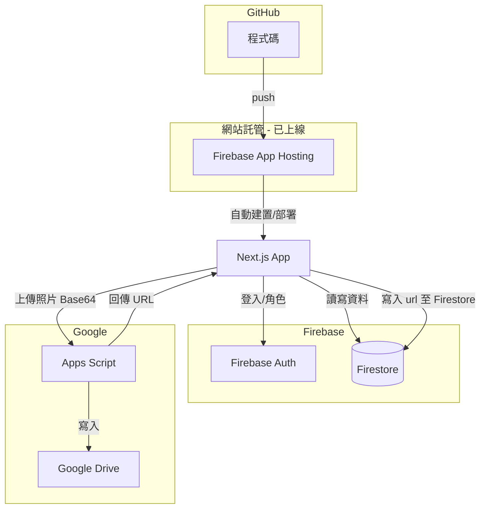

# 906 班網全端優化計畫（依實際程式碼更新）

## 一、現況與目標（依您提供之程式碼）

**現有架構（單一 HTML 親師平台）：**

- **前端：** 單一 `000 (2).txt` 檔案，含 HTML + Tailwind CSS + ES Modules 的內嵌 JavaScript
- **資料來源：** 13 個 Google 試算表（透過 `gviz/tq?tqx=out:csv` 即時取得）
- **上傳：** Google Apps Script Web App，接收 Base64 圖片寫入 Google Drive
- **權限：** 通行碼 `906admin` 保護「常規紀錄」「座位表」「班費」三大區塊
- **Firebase：** 匿名登入（可選）


| 現況                    | 目標                                              |
| --------------------- | ----------------------------------------------- |
| 單一 HTML + 13 個分散試算表   | React SPA + Firestore                           |
| CSV 即時拉取、無後端          | Firebase SDK 直接讀寫                               |
| 通行碼保護三區塊              | Firebase Auth + 角色權限（teacher / staff / student） |
| Apps Script 上傳至 Drive | 沿用 Google Drive（容量較大，15GB+ 免費）                  |
| 無版本控制、手動發布            | GitHub + Firebase Hosting / Vercel 部署           |


## 二、建議技術架構（GitHub + Firebase + Google Drive）

依需求：**Firebase Auth、Firestore** + **相簿存 Google Drive**（避免 Firebase Storage 5GB 限制）+ **Firebase Hosting 或 Vercel 發布**：




**技術選型（已實作）：**

- **前端：** Next.js 15 + React 19、Tailwind CSS、App Router
- **認證：** Firebase Auth（Email/密碼、Google 登入）
- **資料庫：** Firestore（公告、作業、課表、常規、班費等 structured data）
- **相簿：** Google Drive（經 Apps Script），Firestore 只存 `url, title, album, desc, date, uploader` 等 metadata
- **部署：** Firebase App Hosting（已成功，push 至 GitHub 即自動部署）

**容量說明：**

- **Firebase Hosting**（放網站程式）：10GB、360MB/日流量，放 React build 足夠
- **Firestore**：存文字/結構資料，班網用量小
- **Google Drive**：相簿照片，免費 15GB+，較適合大量圖片

## 三、現有模組與試算表對應（依程式碼整理）

以下為您程式碼中實際使用的模組與試算表結構：


| 模組      | 試算表 gid / 用途                | 欄位結構（依程式碼推斷）                                 |
| ------- | --------------------------- | -------------------------------------------- |
| **公告**  | BULLETIN                    | imp, cat, date, title, due, content（含圖片 URL） |
| **作業**  | HOMEWORK                    | 項目, 狀態, 缺交人數, 未交座號                           |
| **課表**  | SCHEDULE / TEACHER_SCHEDULE | 節次 × 週一～五，班級/教師課表                            |
| **日程**  | 整合 BULLETIN + COUNTDOWN     | -                                            |
| **倒數**  | COUNTDOWN                   | rating(星等), title, date, end, subj1, subj2   |
| **榮譽榜** | HONOR_ROLL                  | 進步獎 title, w1~~w4, 前三名 title, w1~~w3         |
| **常規**  | VIOLATIONS                  | 日期, 座號, ?, ?, 事由, 課堂, 節次, 扣分, ?, 狀態          |
| **座位**  | SEATING                     | B1:I50 網格（座號/姓名）                             |
| **相簿**  | GALLERY                     | url, title, album, desc, date, uploader      |
| **塗鴉**  | 無 DB，畫布可上傳至相簿               | -                                            |
| **班費**  | CLASS_FUND                  | 日期, 項目, 收入, 支出, 備註（YOUR_SHEET_ID 待替換）        |
| **文章**  | STORIES                     | cat, title, content, oneLiner（支援 YouTube 連結） |
| **占卜**  | 前端寫死 40+ 籤詩                 | -                                            |
| **投票**  | POLLS                       | 截止日, 標題, Form URL, Q1~Q4 標籤與 entry ID        |
| **連結**  | EXTERNAL                    | cat, title, url                              |


**上傳 API：** `Config.UPLOAD_API` 為 Google Apps Script，接收 `{ date, album, title, uploader, desc, filename, image }` 並寫入 Drive。

## 四、資料模型設計（遷移後）


| 功能  | 資料表                | 對應現有欄位                                             |
| --- | ------------------ | -------------------------------------------------- |
| 公告  | `announcements`    | imp, cat, date, title, due, content                |
| 作業  | `homework`         | item, status, missing_count, missing_seats         |
| 課表  | `schedules`        | 班級/教師、節次、科目                                        |
| 倒數  | `countdown_events` | rating, title, date, end, subj1, subj2             |
| 榮譽榜 | `honor_roll`       | 進步獎/前三名 JSON 結構                                    |
| 常規  | `violations`       | date, seat, reason, subject, period, score, status |
| 座位  | `seating`          | 網格 JSON 或每格一列                                      |
| 相簿  | `gallery_photos`   | url（Drive 連結）, title, album, desc, date, uploader  |
| 班費  | `class_fund`       | date, item, income, expense, note                  |
| 文章  | `stories`          | cat, title, content, oneLiner, videoId             |
| 投票  | `polls`            | 或保留 Google Forms 連結                                |
| 連結  | `links`            | cat, title, url                                    |
| 使用者 | `users`            | email, password_hash, role                         |


**權限：** teacher 全開；staff 可編輯公告/作業/相簿/連結；student 唯讀 + 投票/留言。

**試算表 ID 對照（供遷移腳本使用）：**

- HOMEWORK: `1EIsNhRF2FzbZA1YNWI_0KMSo1MRJWjypy_soeABdEeU` (gid=1576528886)
- VIOLATIONS: `1Il-ImSL6y4-H3lG8h8EcwrmJCgl9ywmryqXwPoY5-3E`
- BULLETIN: `1qzPmxx8rAF4J8XKzYDm5nHyjSgFgyKjmEGFb-L-hOgI`
- SEATING: `1ME-7985DEef46m_skJJqLfOnR_emHr9n6ySRCCz1zHk` (gid=1163058622)
- STORIES: `1yNnxYtq_tlrTM24wYC8bvxHc08Y1t8zd9vFub5kUSV8`
- EXTERNAL: `1dNqibbKUvdW7Xp0S5k1q8vuS71b8G4m9_jWmwJVXC3Y`
- POLLS: `1SvK5CTdcW3U_tQ0m_j1WijmUmAxe7LOzGdoYe4PpJls`
- HONOR_ROLL: `1duSPQtXu3boLwPpnrQ_05ToMYLoZWgBnn1idFv4aKlE`
- SCHEDULE: `1ns4zJ8YSSr0p_xJT8Z9eG6fA0Tic42jEAajt48cBQb4` (gid=0 班級, gid=1988816131 教師)
- GALLERY: `11b03-UlYzI5_9vDTOkzFK2y3v3VwlykFyhIq_RkBrlA`
- COUNTDOWN: `1zGH7zE_0Eu2e4rzOozEUSmCR6obYjTON1Y3Qbrfsk0c`

## 五、GitHub + Firebase 部署流程（已完成）

### 已完成項目

- ✅ **GitHub 儲存庫**：程式碼已推送到 GitHub
- ✅ **Firebase 專案**：`cish-906-school`，已啟用 Auth、Firestore
- ✅ **Firebase App Hosting**：已連接 GitHub，Root directory 設為 `906-class-website`
- ✅ **環境變數**：已寫入 `apphosting.yaml`（NEXT_PUBLIC_FIREBASE_*）
- ✅ **自動部署**：push 至 `main` 分支即觸發建置與部署

### 部署設定摘要

- **託管方式：** Firebase App Hosting（非傳統 Hosting）
- **框架：** Next.js 15，由 App Hosting 自動偵測並建置
- **設定檔：** `apphosting.yaml`（env、scripts.buildCommand、runConfig）
- **參考：** `906-class-website/DEPLOY_GUIDE.md` 完整部署教學

### 步驟四：相簿上傳（沿用現有 Apps Script）— 待實作

- 保留現有 `Config.UPLOAD_API`（Google Apps Script），接收 Base64 寫入 Drive
- 上傳成功後，由 React 將 `{ url, title, album, desc, date, uploader }` 寫入 Firestore `gallery_photos`

---

## 六、專案結構（已實作）

```
f:\School\
├── 906-class-website/
│   ├── src/
│   │   ├── app/                # Next.js App Router 頁面
│   │   ├── components/         # Layout 等
│   │   ├── context/            # AuthContext
│   │   ├── lib/                # firebase.ts、utils.ts
│   │   └── types/
│   ├── public/
│   ├── package.json
│   ├── next.config.ts
│   ├── apphosting.yaml         # App Hosting 設定（env、build）
│   ├── .env.local.example
│   ├── DEPLOY_GUIDE.md         # 部署教學
│   └── scripts/
│       └── migrate-sheets-to-firestore.js
```

## 七、Firestore 集合與 Security Rules

（無 REST API，React 直接操作 Firestore）


| 集合                 | 用途    | 讀取權限           | 寫入權限             |
| ------------------ | ----- | -------------- | ---------------- |
| `announcements`    | 公告    | 全員             | teacher, staff   |
| `homework`         | 作業    | 全員             | teacher, staff   |
| `schedules`        | 課表    | 全員             | teacher          |
| `countdown_events` | 倒數    | 全員             | teacher          |
| `honor_roll`       | 榮譽榜   | 全員             | teacher          |
| `violations`       | 常規    | teacher, staff | teacher, staff   |
| `seating`          | 座位    | teacher, staff | teacher          |
| `gallery_photos`   | 相簿    | 全員             | 全員（上傳）或 staff    |
| `class_fund`       | 班費    | teacher, staff | teacher, staff   |
| `stories`          | 文章    | 全員             | teacher, staff   |
| `links`            | 連結    | 全員             | teacher, staff   |
| `users`            | 使用者角色 | 本人、teacher     | teacher（設定 role） |


**相簿欄位：** `gallery_photos` 存 metadata，`url` 為 Google Drive 分享連結（由 Apps Script 上傳後回傳）。實際檔案存於 Drive，不占用 Firebase 容量。

## 八、試算表資料遷移流程

1. **匯出試算表：**
  - 使用 Google Sheets API 或 CSV 匯出
  - 需申請 Google Cloud 專案並啟用 Sheets API（若用 API）
2. **遷移腳本：**
  - 撰寫 Node.js 腳本讀取 CSV/JSON
  - 依欄位對應寫入新資料庫
  - 處理日期、多值欄位、檔案連結等格式
3. **驗證：**
  - 比對筆數與關鍵欄位
  - 建立對照表供人工抽查

**參考：** 現有程式中的 `Utils.parseData()`（CSV 解析）、`Utils.parseDate()`（民國/西元支援）可改寫為後端 migration 邏輯，保持日期與多值欄位相容。

## 九、前端頁面規劃（對應現有 Tab）


| 路徑                | 頁面  | 現有功能摘要                | 權限  |
| ----------------- | --- | --------------------- | --- |
| `/`               | 首頁  | 倒數、搜尋、通知鈴鐺            | 全員  |
| `/bulletin`       | 公告  | 分類篩選、已讀、置頂、截止日        | 全員  |
| `/schedule`       | 課表  | 班級/教師切換、當節 highlight  | 全員  |
| `/calendar`       | 日程  | 月曆、公告+倒數整合、已截止折疊      | 全員  |
| `/homework`       | 作業  | 缺交人數、未交座號、已讀          | 全員  |
| `/honor-roll`     | 榮譽榜 | 進步獎、前三名               | 全員  |
| `/seating`        | 座位  | 網格、放大、抽籤動畫            | 通行碼 |
| `/gallery`        | 相簿  | 輪播、相簿折疊、上傳、全螢幕        | 全員  |
| `/graffiti`       | 塗鴉  | Canvas、筆刷、文字、下載、上傳至相簿 | 全員  |
| `/class-fund`     | 班費  | 收支表、結餘                | 通行碼 |
| `/violations`     | 常規  | 週次分組、座號篩選、統計          | 通行碼 |
| `/stories`        | 文章  | 閱讀/影音切換、分類、YouTube 嵌入 | 全員  |
| `/fortune`        | 占卜  | 40+ 籤詩隨機              | 全員  |
| `/polling`        | 投票  | Google Form 嵌入        | 全員  |
| `/external-links` | 連結  | 分類                    | 全員  |
| `/login`          | 登入  | JWT 取代通行碼             | 未登入 |


## 十、部署摘要

- **開發：** 本機執行 `npm run dev`，搭配 `.env.local` 中的 Firebase 設定
- **上線：** Firebase App Hosting 已成功，push 至 GitHub `main` 即自動建置與部署
- **Firebase：** Auth、Firestore 由 Google 託管；相簿存 Google Drive，不占用 Firebase Storage 額度

若學校有 Google Workspace，可在 Firebase Auth 啟用 **Google 登入**，使用者以學校帳號登入。

## 十一、實作順序與下一步

### 已完成 ✅

1. ~~專案初始化~~：Next.js + React，Firebase SDK
2. ~~Firebase 設定~~：Auth、Firestore、`firebaseConfig`
3. ~~推上 GitHub~~：程式碼已推送
4. ~~部署~~：Firebase App Hosting 已成功上線
5. ~~Auth 與權限~~：Firebase Auth、`users` 集合查詢角色
6. ~~核心頁面~~：首頁、公告、作業、課表、榮譽榜、相簿、文章、連結、登入等

### 接下來任務（建議順序）


| #   | 任務                     | 說明                                                                       |
| --- | ---------------------- | ------------------------------------------------------------------------ |
| 1   | **試算表資料遷移**            | 執行 `scripts/migrate-sheets-to-firestore.js`，將 Google Sheets 匯入 Firestore |
| 2   | **部署 Firestore Rules** | `firebase deploy --only firestore:rules`，驗證讀寫權限                          |
| 3   | **建立 users 與角色**       | 在 Firestore `users` 建立 teacher/staff 文件，供權限頁面使用                          |
| 4   | **相簿上傳**               | 連接 Apps Script API（NEXT_PUBLIC_UPLOAD_API），上傳後寫入 `gallery_photos`        |
| 5   | **常規／座位／班費**           | 從 Firestore 讀取並顯示，完成 teacher/staff 專用區塊                                  |
| 6   | **日程整合**               | 月曆整合公告與倒數資料                                                              |
| 7   | **投票**                 | 嵌入 Google Form 或讀取 `polls` 集合                                            |
| 8   | **塗鴉牆**                | Canvas 畫布、上傳至相簿                                                          |


---

## 附錄：現有程式碼可復用邏輯

- `**Utils.parseDate()**`：民國年、西元年、多種日期格式
- `**Utils.parseData()**`：CSV 含引號與換行
- **抽籤動畫**：`SeatingModule.randomDraw` + confetti
- **塗鴉**：`GraffitiModule` 畫布、歷史、上傳至相簿
- **相簿**：輪播、全螢幕、相簿折疊、上傳表單欄位
- **通知**：`ReadStatus`（localStorage）、`NotificationSystem`
- **搜尋**：`SearchModule` 跨 bulletin/homework/stories/links

**建議：** 將 `000 (2).txt` 另存為 `reference/original.html` 供對照，新專案在 `f:\School\906-class-website\` 建立。

**相簿上傳流程：** 沿用現有 Apps Script（`Config.UPLOAD_API`），接收 Base64 寫入 Google Drive 並回傳分享 URL；React 將 metadata 寫入 Firestore `gallery_photos`。